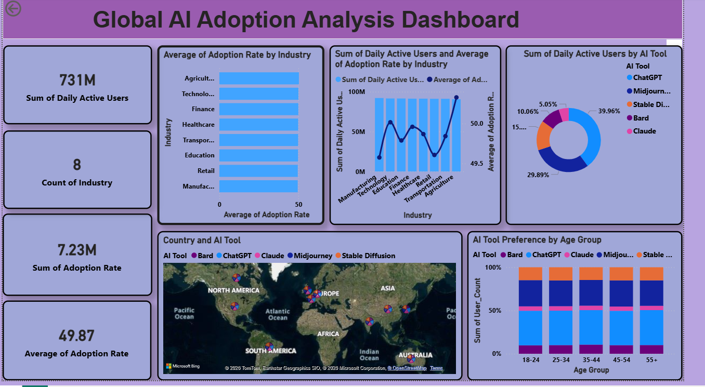

# 🌍 Global AI Adoption Analysis Dashboard (2023–2024)

## 📊 Overview
This project analyzes AI tool adoption across industries, countries, and user groups using Power BI.

## 🚀 Features
- Industry-wise AI adoption  
- AI tool popularity (ChatGPT, Bard, Claude, etc.)  
- Age group analysis  
- Global map visualization  

## 🛠 Tools Used
- Power BI  
- Power Query  
- DAX  

## 📸 Dashboard Preview

## 📈 Key Insights
- High AI adoption across industries  
- ChatGPT is one of the most used tools  
- Strong usage in 25–44 age group  
